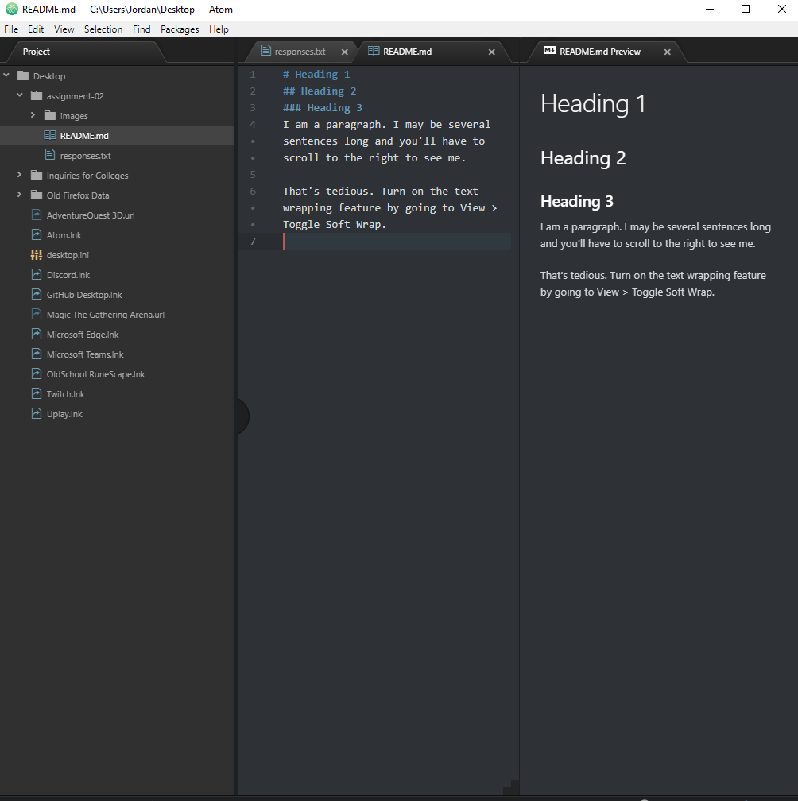

# Assignment 2
## Jordan Lyman
I decided to take this class because I have taken many computer science classes and I thought that this would be interesting.

I hope to learn:
* A better understanding of markdown.
* How to better my html code.
* Anything about CSS!

[Reddit](https://www.reddit.com)

[My Responses](./responses.txt)

