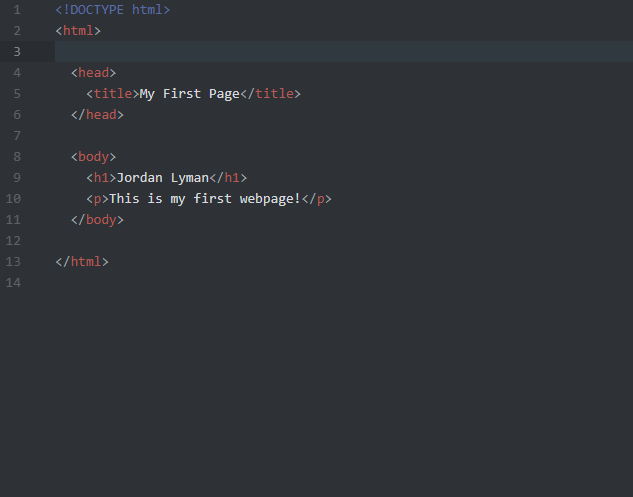

# Responses for Assignment 3

13. Browsers function as multiple pieces. First, you have the user interface that displays the address bar, the tabs, and the back/forward buttons. To function, the rendering engine requests the html, css, and other needed webpage documents from the network. Once provided, the rendering engine reads the HTML and creates a DOM, made up of nodes. It thens processes the CSS and builds the CSSOM tree. The DOM and CSSOM trees are combined to make the render tree. The render tree will then go through the layout process to display the page. Other needed parts are the browser engine, which directs the actions between the UI and the rendering engine, and the javascript intepreter, which allows the browser to understand the javascript code. Data storage is also need for cookies and local storage. I currently use Firefox, but have also used Chrome.

14. A markup language is a computer code language that uses tags to mark the elements within a document. One that is very commonly used it HTML. HTML, or hypertext markup language, defines the foundation and structure of page content. It renders the content and the page structure. A difficulty with HTML is that it has many updates and may have difficulty displaying on mobile devices.

