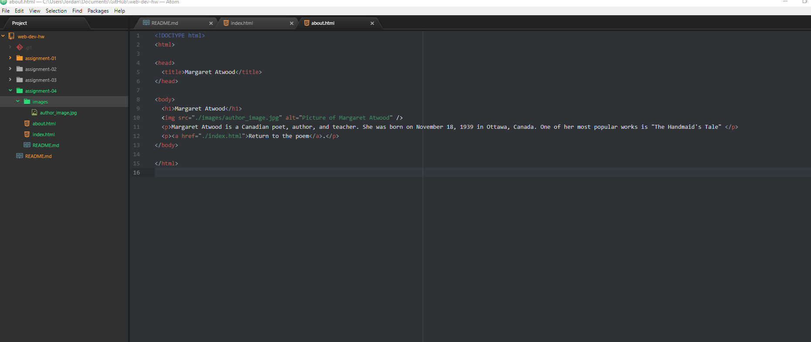

# Assignment 4 README

 13. On the Wayback Machine, I looked at the website for AddictingGames.com from 2003. It looked like you'd expect an old website to. An interesting WordArt logo with the links to the games being just simple text links, without photos. Now, the website has a way better logo and all of the games have images, if not gifs, to preview the game before you click on it. They also went into dark mode, from the original plain white background. The fonts are more modern.

 14.This GIT Module has been extremely helpful towards my learning. In my previous coding classes, I had used GIT a little bit, but not as much as I have in the last week. Learning about GIT desktop was nice how it fit right in with the use of Atom. I also didn't know that you could upload repos by simply dragging and dropping. That makes it way easier. There are still many unknowns, like the pull requests, but look forward to increased use of GIT. The simple website hosting was also unknown to me at the start.

 
