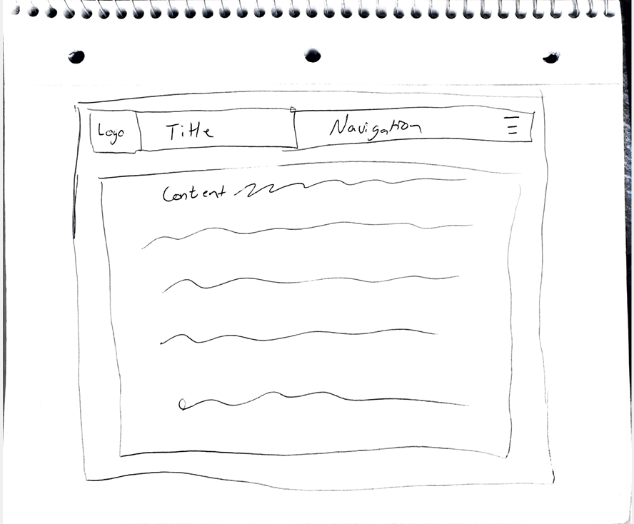

# Answers for Assignment 11

13. The difference between padding, margin, and borders lies in where attribute is affecting. Padding gives transparent space around the content inside of an element. Margin gives transparent space outside of an element. The border goes around the padding of an element, which can either be transparent or any combination of size, styles, and colors. The border is more of a style choice.

14. 

15. This was by far the most challenging assignment that we had so far. I made the site sketch and I thought it would be fairly simple. I then added my index.html and add the main elements and the meta elements. I linked my stylesheet and then added the images I needed into the folder. I created the divs I needed and then started on the navigation. I tried to use some of the examples to make a hover dropdown navigation but I spent HOURS on this. It was so hard and sometimes my hover works and sometimes it doesn't. I also struggled with sizing. If I made my browser too small, I struggled with keeping the title and nav within the header and not going over the main content of the page. I understand what each of the attributes does, but struggled to use them effectively. I added the main content to my page and that wasn't too bad to style that. Overall, I just need to work more on my navigation. The new header piece was the hardest part for me. I just need more practice.
